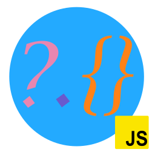

# scope-extensions-js

[](https://travis-ci.com/TheDavidDelta/scope-extensions-js)
[](./LICENSE)



Package for using [Kotlin's Scope Function Extensions](https://kotlinlang.org/docs/reference/scope-functions.html) on JavaScript and TypeScript.

It also supports the use of the new [Optional Chaining Operator](https://github.com/tc39/proposal-optional-chaining), bringing the logic of [Kotlin's Null Safe Calls](https://kotlinlang.org/docs/reference/null-safety.html) to the JavaScript world.

---

## Usage

Simply call any value with `let`, `also`, `run` or `apply` and it'll be passed as the argument or the context of a scope function.

```typescript
const obj = { name: "Daniel", age: 30 };

obj.let(it => {
    return it.age < 0 ? it.age : 0;
}).also(it => {
    console.log(it);
}); // prints 30
```

This way, you can execute a block of code only if a value is neither null non undefined.

```typescript
const str: string | null = await getData();

// later
str?.also(it => {
    console.log(`Already initialized: ${it}`);
}) ?? console.log("Still not initialized");
```

The above code is equivalent to this

```typescript
if (str != null && str != undefined)
    console.log(`Already initialized: ${str!}`);
else
    console.log("Still not initialized");
```

## Diferences

We could group the 4 extensions into 2 groups of 2 groups each, based on both the argument type and the return value:
+ `let` & `also` receive the caller instance as a function parameter, and `run` & `apply` receive the caller instance as the function context (`this`).
+ `let` & `run` return the function result (`return`) value, and `also` & `apply` return the caller instance (`this`).

Summed up in this table:

|                    | **`it` argument** | **`this` context** |
|--------------------|:-----------------:|:------------------:|
| **Returns result** | `let`             | `run`              |
| **Returns `this`** | `also`            | `apply`            |

`let` & `also` can be called with standard lambda/arrow functions, but because JavaScript arrow functions don't have an own `this` context, `run` & `apply` have to be called with standard functions.

Here is an example of each one of them:
+ let
```typescript
const data: Array<number> | null = await idsFromFile();

const str = data?.let(it => 
    processToString(it);
) ?? "empty";
```
+ also
```typescript
const list: Array<string> = model.getNames();

const filtered = list.also(it => 
    it.slice(0, 4);
).also(it =>
    applyFilter(filter, it);
).also(console.log);

// same as
const filtered = list.also(it => {
    it.slice(0, 4);
    applyFilter(filter, it);
    console.log(it);
});
```
+ run
```typescript
const list: Array<object> | undefined = currentAcc?.getContacts();

const lastsByName = list?.run(function() {
    this.filter();
    this.reverse();
    return this.slice(0, 3);
});
```
+ apply
```typescript
const obj = { name: "Daniel", age: 30 };

obj.apply(function() {
    this.name = "Dan";
    this.age++;
    this["country"] = "Canada";
});
```

## License

Copyright © 2020 [TheDavidDelta](https://github.com/TheDavidDelta).  
This project is [MIT](./LICENSE) licensed.
